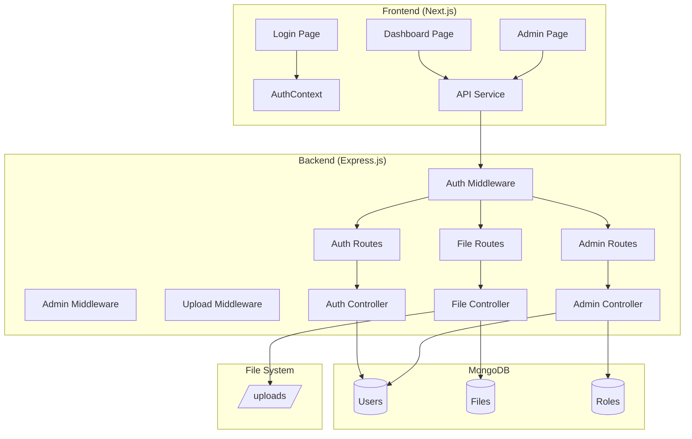

# Secure File Management System (Secure_FMS_CSE241)
## Project Brief & Technical Report

---

## 1. Project Overview

**Secure FMS** is a full-stack web application designed to provide **secure file storage and management** with **Role-Based Access Control (RBAC)**. The system enables users to securely upload, download, and manage files while administrators can manage users and access permissions.

### Key Features
- 🔐 **Secure Authentication** using JWT tokens
- 🔒 **Password Hashing** using bcrypt (salt rounds: 10)
- 📁 **File Upload/Download** with ownership tracking
- 🛡️ **AES-256-CBC File Encryption** at rest
- 👥 **Role-Based Access Control** (Superadmin, Admin, User)
- 📧 **Email Service** integration for notifications
- 🎨 **Modern React Frontend** with Next.js

---

## 2. Technology Stack

### Backend
| Technology | Version | Purpose |
|------------|---------|---------|
| Node.js | - | Runtime Environment |
| Express.js | 5.2.1 | Web Framework |
| MongoDB | - | Database |
| Mongoose | 8.21.0 | ODM for MongoDB |
| JWT | 9.0.3 | Token-based Authentication |
| bcrypt | 6.0.0 | Password Hashing |
| multer | 2.0.2 | File Upload Handling |

### Frontend
| Technology | Purpose |
|------------|---------|
| Next.js | 16.1.1 | React Framework |
| React | UI Library |
| Axios | HTTP Client |
| Lucide React | Icons |

---

## 3. System Architecture



---

## 4. Database Schema

### 4.1 Users Collection
```javascript
{
    username: String (required, unique),
    email: String (required, unique),
    password: String (required, hashed),
    role: ObjectId → Role (required),
    is_active: Boolean (default: true),
    created_by: ObjectId → User,
    created_at: Date,
    updated_at: Date
}
```

### 4.2 Roles Collection
```javascript
{
    role_name: String (required, unique),
    description: String
}
```

**Predefined Roles:**
| Role | Description |
|------|-------------|
| `superadmin` | System Owner - Full access to all features |
| `admin` | Administrator - Can view all files, manage users they created |
| `user` | Standard User - Can only view/manage own files |

### 4.3 Files Collection
```javascript
{
    original_name: String (required),
    stored_name: String (required, UUID),
    file_hash: String (optional),
    owner_id: ObjectId → User (required),
    mimeType: String,
    size: Number,
    created_at: Date,
    updated_at: Date
}
```

---

## 5. Security Implementation

### 5.1 Password Security
- **Algorithm:** bcrypt with 10 salt rounds
- **Location:** `models/User.js` (pre-save middleware)
- **Validation:** Passwords must be 8+ characters with at least one number and one special character

```javascript
// Password hashing (pre-save hook)
const salt = await bcrypt.genSalt(10);
this.password = await bcrypt.hash(this.password, salt);
```

### 5.2 JWT Authentication
- **Algorithm:** HS256
- **Expiration:** 24 hours
- **Payload:** `{ userId, role }`
- **Storage:** localStorage (frontend)

### 5.3 File Encryption
- **Algorithm:** AES-256-CBC
- **Key:** 32-byte hex key from environment variable
- **IV:** Random 16 bytes prepended to encrypted data
- **Location:** `utils/fileCrypto.js`

```javascript
// Encryption flow
const iv = crypto.randomBytes(16);
const cipher = crypto.createCipheriv('aes-256-cbc', ENCRYPTION_KEY, iv);
return Buffer.concat([iv, encrypted]);
```

### 5.4 Referential Integrity
Both User and File models enforce referential integrity via pre-save hooks:
- Users cannot be assigned non-existent roles
- Files cannot be created for non-existent users

---

## 6. API Endpoints

### 6.1 Authentication (`/api/auth`)
| Method | Endpoint | Description | Access |
|--------|----------|-------------|--------|
| POST | `/login` | User login | Public |
| GET | `/me` | Get current user | Private |

### 6.2 File Management (`/api/files`)
| Method | Endpoint | Description | Access |
|--------|----------|-------------|--------|
| POST | `/upload` | Upload a file | Private |
| GET | `/` | List user's files | Private |
| GET | `/download/:id` | Download a file | Private (Owner/Admin) |
| DELETE | `/:id` | Delete a file | Private (Owner/Admin) |

### 6.3 Admin Management (`/api/admin`)
| Method | Endpoint | Description | Access |
|--------|----------|-------------|--------|
| POST | `/create-user` | Create new user | Admin/Superadmin |
| PATCH | `/update-user/:id` | Update user | Admin/Superadmin |
| DELETE | `/delete-user/:id` | Delete user | Admin/Superadmin |
| GET | `/users` | List all users | Admin/Superadmin |

---

## 7. Role-Based Access Control (RBAC)

### Permission Matrix

| Feature | Superadmin | Admin | User |
|---------|:----------:|:-----:|:----:|
| View own files | ✅ | ✅ | ✅ |
| Upload files | ✅ | ✅ | ✅ |
| Delete own files | ✅ | ✅ | ✅ |
| View all files | ✅ | ✅ | ❌ |
| Delete any file | ✅ | ✅ | ❌ |
| Create users | ✅ | ✅ (user role only) | ❌ |
| Create admins | ✅ | ❌ | ❌ |
| View all users | ✅ | Own creations only | ❌ |
| Delete any user | ✅ | Own creations only | ❌ |
| Access admin panel | ✅ | ✅ | ❌ |

---

## 8. Frontend Structure

### Pages
| Path | Component | Description |
|------|-----------|-------------|
| `/` | `page.js` | Landing/Home page |
| `/login` | `login/page.js` | User authentication |
| `/dashboard` | `dashboard/page.js` | File management interface |
| `/admin` | `admin/page.js` | User management panel |

### Key Components
| Component | Purpose |
|-----------|---------|
| `AuthContext.js` | Global authentication state management |
| `ProtectedRoute.js` | Route guard for authenticated pages |
| `FileTable.js` | Display and manage files |
| `UploadButton.js` | File upload interface |
| `UserTable.js` | Display and manage users |
| `UserForm.js` | Create/edit user forms |
| `Navbar.js` | Navigation header |
| `Toast.js` | Notification system |
| `ConfirmationModal.js` | Delete confirmation dialogs |
| `OTPInput.js` | OTP verification input |

---

## 9. Project File Structure

```
Secure_FMS_CSE241/
├── backend/
│   ├── app.js                    # Express server entry point
│   ├── config/
│   │   └── db.js                 # MongoDB connection
│   ├── controllers/
│   │   ├── authController.js     # Login/Auth logic
│   │   ├── fileController.js     # File CRUD operations
│   │   └── adminController.js    # User management
│   ├── middleware/
│   │   ├── authMiddleware.js     # JWT verification
│   │   ├── adminMiddleware.js    # Admin role check
│   │   └── uploadMiddleware.js   # Multer file handling
│   ├── models/
│   │   ├── User.js              # User schema + password hashing
│   │   ├── Role.js              # Role schema
│   │   └── File.js              # File schema + access control
│   ├── routes/
│   │   ├── auth.routes.js
│   │   ├── file.routes.js
│   │   └── admin.routes.js
│   ├── scripts/
│   │   └── seed_db.js           # Database seeding script
│   ├── utils/
│   │   ├── fileCrypto.js        # AES encryption utilities
│   │   └── emailService.js      # Email notifications
│   ├── uploads/                  # Encrypted file storage
│   └── .env                      # Environment variables
│
└── frontend/
    └── src/
        ├── app/
        │   ├── layout.js         # Root layout
        │   ├── page.js           # Home page
        │   ├── globals.css       # Global styles
        │   ├── login/page.js     # Login page
        │   ├── dashboard/page.js # File management
        │   └── admin/page.js     # Admin panel
        ├── components/           # Reusable UI components
        ├── context/
        │   └── AuthContext.js    # Auth state provider
        └── services/
            ├── api.js            # Axios instance
            ├── authService.js    # Auth API calls
            ├── fileService.js    # File API calls
            └── adminService.js   # Admin API calls
```

---

## 10. Environment Configuration

### Backend `.env`
```env
MONGO_URI=mongodb://localhost:27017/secure_fms
JWT_SECRET=your-super-secret-jwt-key-change-in-production
ENCRYPTION_KEY=YOUR_GENERATED_HEX_KEY_HERE
BASE_URL=http://localhost:5000
PORT=5000
```

### Generate Secure Keys
```bash
# Generate JWT Secret (64 bytes)
node -e "console.log(require('crypto').randomBytes(64).toString('hex'))"

# Generate Encryption Key (32 bytes for AES-256)
node -e "console.log(require('crypto').randomBytes(32).toString('hex'))"
```

---

## 11. Running the Application

### Prerequisites
- Node.js (v18+)
- MongoDB (local or Atlas)

### Backend
```bash
cd backend
npm install
node scripts/seed_db.js  # Seed database with roles and superadmin
npm start                 # Starts on port 5000
```

### Frontend
```bash
cd frontend
npm install
npm run dev              # Starts on port 3000
```

### Default Credentials
| Field | Value |
|-------|-------|
| Email | `superadmin@admin.com` |
| Password | `admin123` |

---

## 12. Security Considerations

### Implemented
- ✅ Password hashing with bcrypt
- ✅ JWT token-based authentication
- ✅ Role-based access control
- ✅ File encryption at rest (AES-256)
- ✅ Referential integrity checks
- ✅ Input validation (email format, password strength)
- ✅ CORS configuration
- ✅ Automatic token cleanup on 401 errors

### Recommendations for Production
- [ ] Enable HTTPS/TLS
- [ ] Use HTTP-only cookies instead of localStorage for tokens
- [ ] Add rate limiting for authentication endpoints
- [ ] Implement account lockout after failed login attempts
- [ ] Add file type validation/sanitization
- [ ] Enable MongoDB authentication
- [ ] Add audit logging for sensitive operations
- [ ] Implement password reset functionality
- [ ] Add two-factor authentication (OTP component exists)

---

## 13. Summary

**Secure FMS** demonstrates a complete implementation of a secure file management system with:
- Modern full-stack architecture (Node.js + React/Next.js)
- Industry-standard security practices (JWT, bcrypt, AES-256)
- Flexible role-based access control
- Clean separation of concerns
- Scalable database design with MongoDB

The system is suitable for educational demonstration of secure web application development principles and can serve as a foundation for production-grade file management solutions.
